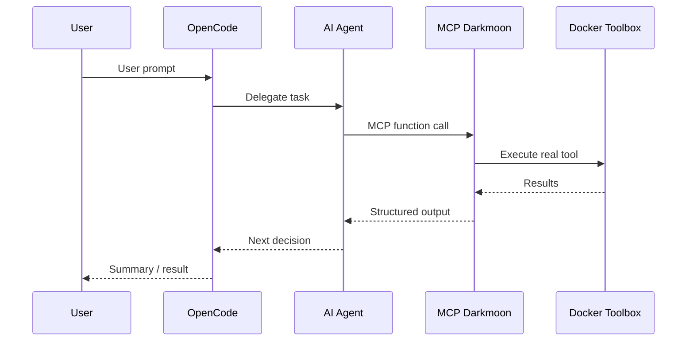

<div align="center">


**The Open-Source AI-Powered Autonomous Penetration Testing Platform**

[](https://www.gnu.org/licenses/gpl-3.0)
[](https://github.com/ASCIT31/Dark-Moon)

[Full Documentation](docs/full.md) · [Contributing](CONTRIBUTING.md) · [License](LICENSE)

</div>

---

## What is DarkMoon?

DarkMoon is an **automated penetration testing tool** that orchestrates complete security assessments using **artificial intelligence security** agents. Built as an open-source **cybersecurity tool**, it enables organizations to run professional-grade **vulnerability assessments** without manual intervention.

Instead of replacing the pentester, DarkMoon acts as an **autonomous security testing system** — it reasons, plans, and coordinates specialized agents that execute real offensive security operations through a controlled execution layer.

<div>
  <a href="https://youtu.be/1bFRVuMkZzY?si=peKxwuxzbXBnb2zO">
    
  </a>

  <p><strong>Watch DarkMoon in action — Full autonomous penetration test demo</strong></p>
</div>

---

## Why DarkMoon?

Traditional **penetration testing** is:

- ⏱️ **Time-consuming** — manual testing takes weeks
- 💰 **Expensive** — expert consultants cost thousands per day
- 🔄 **Inconsistent** — results vary by tester expertise
- 📊 **Hard to scale** — limited by human resources

DarkMoon solves this with **AI penetration testing**:

- 🤖 **AI-powered pentesting** — autonomous agents conduct full security assessments end-to-end
- 🛡️ **Security by design** — the AI never directly executes tools; all actions flow through a controlled MCP interface
- ♾️ **Pentesting automation for CI/CD** — run **automated security testing** post-build to catch critical vulnerabilities before production
- 🔧 **50+ integrated tools** — a comprehensive **penetration testing tools suite** (Nuclei, NetExec, BloodHound, sqlmap, Naabu, httpx, ffuf, and more)
- 📈 **Adaptive multi-agent methodology** — specialized agents for Web, Active Directory, Kubernetes, Network, CMS, and more
- 📝 **Vulnerability reporting automation** — structured, evidence-based reports generated automatically

Perfect for **security teams**, **DevSecOps engineers**, **ethical hacking** professionals, and organizations of all sizes.

---

## Quick Start

### Prerequisites

- Docker & Docker Compose
- An LLM API key (OpenRouter, Anthropic, OpenAI, or local models)

> **Note:** GPU configuration, NVIDIA driver troubleshooting, and advanced environment setup are covered in the [Full Documentation — GPU Troubleshooting](docs/full.md#ii2--darkmoon--gpu-troubleshooting-guide-official).

### Installation

**1. Clone the repository**

```bash
git clone https://github.com/ASCIT31/Dark-Moon.git
cd Dark-Moon
```

**2. Configure your LLM provider**

`install.sh` handles provider configuration interactively — no need to edit `docker-compose.yml`:

```bash
./install.sh           # skip form if .opencode.env already configured
./install.sh --init    # force reconfiguration (cloud or local model)
./install.sh --help    # show usage
```

Supports **cloud providers** (Anthropic, OpenAI, OpenRouter…) and **local models** (Ollama, llama.cpp).

> **Note:** For full details on environment variables and local model setup, see the [Full Documentation — Environment Variables](docs/full.md#ii3-configuration-of-environment-variables).

**3. Build and launch**

```bash
./install.sh  # Clean install with full stack reset
```

**4. Run your first assessment**

```bash
./darkmoon.sh "TARGET: example.com"
```

**5. Monitor in real-time**

```bash
./darkmoon.sh --log <session_id>
```

> **Note:** Real-time session logs display every command executed by the MCP server. See [Full Documentation — Session Logs](docs/full.md#ii7e-step-1--start-an-assessment) for details.

---

## How It Works

DarkMoon operates as a strategic **AI security agent** orchestrator aligned with ISO 27001, NIST SP 800-115, and MITRE ATT&CK methodologies.

When you provide a target, the platform automatically:

1. 🔍 **Discovers** the target environment (ports, services, protocols)
2. 🧠 **Fingerprints** the technology stack (frameworks, CMS, APIs)
3. 🎯 **Models** the attack surface
4. 🚀 **Deploys** specialized sub-agents based on detected technologies
5. 🔬 **Executes** an **intelligent vulnerability scanning** loop with reactive adaptation
6. ✅ **Validates** findings with evidence (requests, payloads, responses)
7. 📝 **Generates** a structured audit report

### Sub-Agent Orchestration

DarkMoon dynamically selects and dispatches specialized agents depending on the technologies discovered:

| Detected Technology | Agent Triggered |
|---|---|
| WordPress, Drupal, Joomla, Magento, PrestaShop, Moodle | CMS-specific agent |
| PHP, Node.js, Flask, ASP.NET, Spring Boot, Ruby on Rails | Stack-specific agent |
| GraphQL | GraphQL agent |
| Active Directory | AD agent |
| Kubernetes | Kubernetes agent |
| Headless browser required | Headless browser agent |

Multiple agents can execute **in parallel** across hybrid architectures.

> **Note:** For the complete list of agents, their structure, lifecycle, and how to create custom agents, see [Full Documentation — AI Agents](docs/full.md#v-ai-agents).

### Architecture Overview

```
User ──> DarkmoonCLI ──> OpenCode (AI Brain) ──> MCP (Security Gatekeeper) ──> Docker Toolbox (Real Tools)
```



The AI reasons and plans. The MCP controls what can be executed. The Toolbox runs isolated tools inside Docker. **The AI never directly touches the system** — this is **security by design**.

> **Note:** For the full architecture breakdown (deployment diagrams, network flows, security boundaries), see [Full Documentation — Architecture](docs/full.md#iv-architecture).

---

## Scope Definition

DarkMoon supports flexible scope definition directly from the command line.

**Quick pentest (zero config):**

```bash
./darkmoon.sh "TARGET: http://172.19.0.3:3000"
```

**Bug bounty mode (flags activate automatically):**

```bash
./darkmoon.sh "TARGET: http://172.19.0.3:3000 PROGRAM=\"Juice Shop\" FOCUS=sqli,xss,idor NOISE=moderate FORMAT=h1"
```

Key flags include `FOCUS`, `EXCLUDE`, `CREDS`, `TOKEN`, `NOISE`, `SEVERITY`, `FORMAT`, and more — all interpreted naturally by the AI.

> **Note:** For the complete flags reference, asset types, EXCLUDE/FOCUS free-form syntax, and advanced multi-target scoping, see [Full Documentation — Scope Definition](docs/full.md#ii7c-launch-darkmoon-with-tui-console).

---

## Integrated Toolbox

DarkMoon ships with a purpose-built Docker image containing **50+ security tools** compiled and optimized in a multi-stage build:

| Category | Tools (examples) |
|---|---|
| Port scanning | Naabu, Masscan |
| Web scanning | Nuclei, ffuf, dirb, sqlmap, Arjun, wafw00f |
| Recon & crawling | Subfinder, Katana, Waybackurls, httpx |
| CMS | WPScan, CMSeeK, WhatWeb |
| Active Directory | NetExec, BloodHound, Impacket (30+ scripts) |
| Kubernetes | kubectl, Kubescape, Kubeletctl |
| Network | Hydra, curl, dig, SNMP tools |
| Browser | Lightpanda (headless) |

All tools are directly accessible — no path configuration needed.

> **Note:** For the complete tools list with installation details and how to add new tools, see [Full Documentation — Toolbox](docs/full.md#vi-toolbox).

---

## 📖 Documentation Guide

DarkMoon's [Full Documentation](docs/full.md) covers everything you need to operate the platform. Here is a quick reference to the most important sections:

| Topic | What You'll Find | Link |
|---|---|---|
| **GPU & Driver Setup** | NVIDIA troubleshooting for Docker, WSL, and native Linux | [GPU Guide](docs/full.md#ii2--darkmoon--gpu-troubleshooting-guide-official) |
| **Environment Variables** | LLM provider configuration, API keys, model selection | [Environment Config](docs/full.md#ii3-configuration-of-environment-variables-in-docker-compose) |
| **Startup & Build** | install.sh behavior, docker compose build, stack management | [Build & Launch](docs/full.md#ii6-build-and-launch-darkmoon) |
| **Scope & Flags** | TARGET syntax, bug bounty mode, FOCUS/EXCLUDE, credentials | [Scope Definition](docs/full.md#ii7c-launch-darkmoon-with-tui-console) |
| **Assessment Workflow** | Step-by-step: discovery, fingerprinting, agents, reporting | [Assessment Engine](docs/full.md#ii7d-how-to-use-the-darkmoon-assessment-engine) |
| **Real-Time Session Logs** | Monitor commands executed by the MCP server live | [Session Logs](docs/full.md#ii7e-step-1--start-an-assessment) |
| **AI Agents** | Agent structure, lifecycle, how to create or modify agents | [AI Agents](docs/full.md#v-ai-agents) |
| **Architecture** | Deployment diagrams, security boundaries, execution flow | [Architecture](docs/full.md#iv-architecture) |
| **Toolbox** | Complete tool list, adding tools, Docker image internals | [Toolbox](docs/full.md#vi-toolbox) |
| **MCP Workflows** | Workflow structure, creating custom workflows, best practices | [MCP Workflows](docs/full.md#vii-mcp-workflows) |
| **Available Tools List** | Full table of 50+ tools with paths and sources | [Tools List](docs/full.md#vi10-toolbox-list) |
| **Training Labs** | Recommended vulnerable labs to train DarkMoon | [Pentester Labs](docs/full.md#vi11-bonus-pentester-lab-to-train-darkmoon) |

---

## Use Cases

DarkMoon is designed as a versatile **security testing platform** for:

- 🔒 **Security teams** — run continuous **automated penetration testing** across your infrastructure
- ⚙️ **DevSecOps pipelines** — integrate **AI-driven security research** into CI/CD workflows
- 🎯 **Bug bounty hunters** — accelerate **ethical hacking** with autonomous target analysis
- 🔬 **Security researchers** — explore attack surfaces with an **AI cybersecurity platform** that adapts in real time
- 🎓 **Training & education** — learn offensive security with guided, reproducible assessments

---

## Example Prompts

```bash
# Web application pentest
./darkmoon.sh "TARGET: http://172.19.0.3:3000"

# Active Directory assessment
./darkmoon.sh "TARGET: 192.168.1.10"

# Bug bounty with specific focus
./darkmoon.sh "TARGET: https://app.example.com PROGRAM=\"Example BB\" FOCUS=sqli,rce,ssrf EXCLUDE=H1 FORMAT=h1"
```

> **Note:** For more prompt examples including DVGA, Juice Shop, and headless browser scenarios, see [Full Documentation — Prompt Examples](docs/full.md#iii-uses).

---

## Contributing

DarkMoon is open source and welcomes contributions. Whether you want to add new agents, integrate tools, create workflows, or improve documentation — see [CONTRIBUTING.md](CONTRIBUTING.md) for guidelines.

---

## License

This project is licensed under the **GNU General Public License v3.0**. See [LICENSE](LICENSE) for details.

---

<div align="center">

**Built by ASC-IT with 💚 for the global security community**

🔒 Open Source · 🤖 AI-Powered · 🇫🇷 Made in France

[⭐ Star us on GitHub](https://github.com/ASCIT31/darkmoon) · [📖 Full Documentation](docs/full.md) · [▶️ Watch the Demo](https://youtu.be/1bFRVuMkZzY?si=peKxwuxzbXBnb2zO)

</div>
